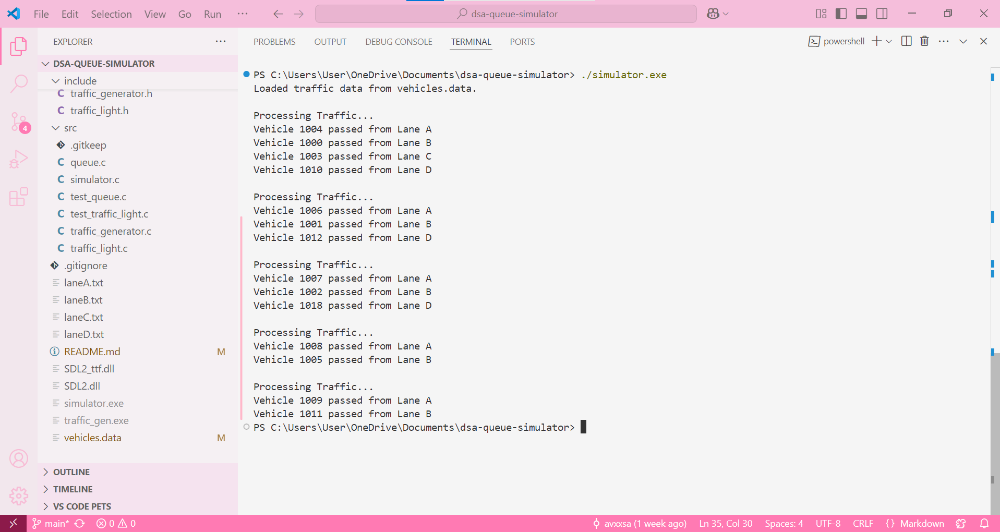

# DSA Queue Traffic Simulator 🚦

This is my implementation of a **queue-based traffic simulation** for a four-way junction.  
The project models **traffic lights**, **vehicle queues**, and **priority-based rules** using **C programming**.

---

## 🚀 Features
✅ Simulates **real-world traffic flow** using queue data structures  
✅ Uses **file-based communication** to pass vehicle data between processes  
✅ Implements **priority-based traffic light control** for efficient vehicle movement  
✅ Processes **vehicles dynamically** based on queue conditions  

---

## 🛠 How I Compiled and Ran the Program  
### **Step 1: Compiling the Program**
```sh
gcc src/simulator.c src/queue.c src/traffic_light.c src/traffic_generator.c -o simulator.exe -I include 
```
### **Step 2: Running the Simulator**
```sh
.\simulator.exe
```
---

## 📸 Demo (Screenshots)



---

## 📂 Project Structure
This is how I structured my project files:
📦 dsa-queue-simulator
├── 📂 src
│   ├── simulator.c
│   ├── traffic_generator.c
│   ├── traffic_light.c
│   ├── queue.c
│   ├── test_queue.c
│   ├── test_traffic_light.c
│
├── 📂 include
│   ├── queue.h
│   ├── traffic_light.h
│   ├── traffic_generator.h
│
├── 📂 docs
│   ├── report.pdf  (Final report will be added here)
│
├── README.md
└── .gitignore

---

## 📚 References
I referred to the following resources while implementing this project:
- [Simple DirectMedia Layer 2.0 (SDL2) Documentation](https://wiki.libsdl.org/SDL2/FrontPage)
- Data Structure & Algorithms (COMP202) - Assignment PDF (provided by the professor)

---

## 🔗 GitHub Repository
You can find the complete source code here:
[https://github.com/avxxsa/dsa-queue-simulator](https://github.com/avxxsa/dsa-queue-simulator)
